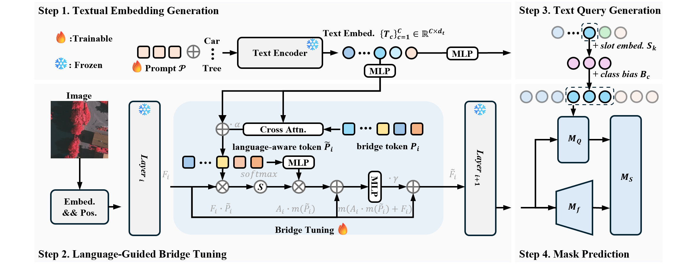

<h2 style="border-bottom: 1px solid lightgray;">
VLBridge: Domain Generalizable Remote Sensing Semantic Segmentation via Textual-Guided Tuning
</h2>

Bin Wang 1,
Fei Deng 2,
Yiguang Liu1†

1 Sichuan University
2 Chengdu University of Technology

† Corresponding author.

[//]: # (* Equal contribution.)

   
    
    
    
    
     
    
    
    
    
    

 

 Network Overview 

### 🔍️🔍️ NEWS
- [2026/08/25] ✨✨ Init Repo.

### 😀😀 The code will releasing soon